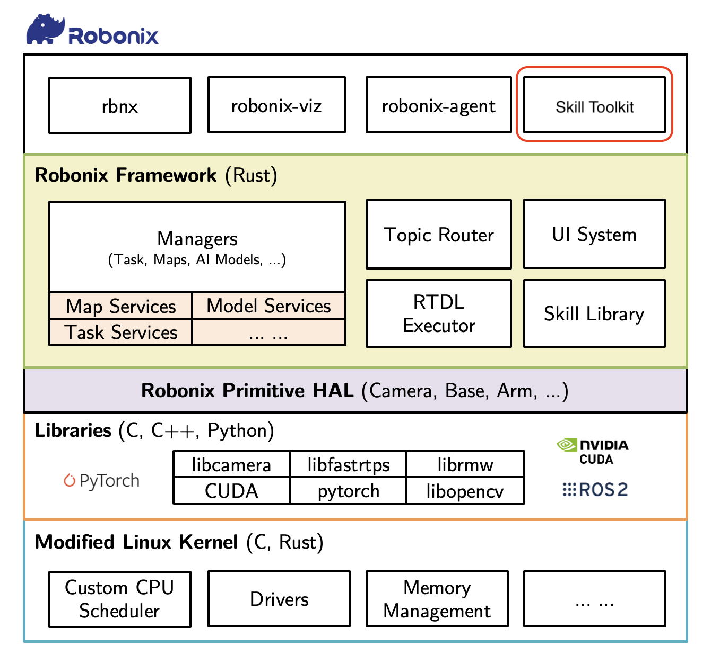
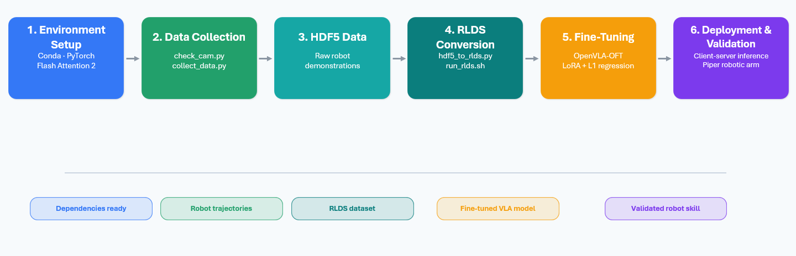
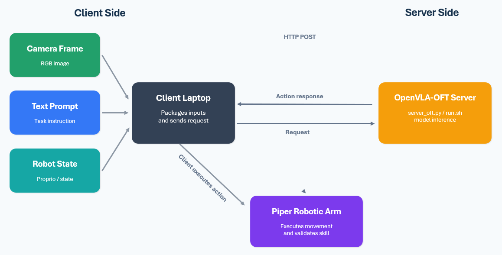
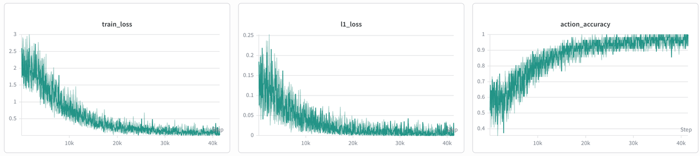

<p align="center">
  
</p>

# Robonix-Skill-Toolkit

This project provides detailed guidelines to implement data collection, fine-tuning, deployment and optimization on physical robotic arms based on the VLA model！Specifically, we provide the following function:

1. Skill Development Workflow under Robonix
2. High-Efficient Deployment guidance for VLA-based Skills
3. Data collection, data cleaning and data utilization mechanism with Real-World Robotic Arm



# News
* 🔥 [2026-06] We actively adapt to various hardware including robotic arms and cameras, and provide relevant codes for skill acceleration in the future.
* 🔥 [2026-06] We released Robonix-SKill-Toolkit for [Robonix](https://github.com/syswonder/robonix), based on [OpenVLA-OFT](https://openvla-oft.github.io) framework and [AgileX Piper Robotic Arm](https://github.com/agilexrobotics/Agilex-College)！
* 🔥 [2026-07] Our Robonix-Skill-Toolkit now supports multitasks!

# Hardware & System Config

| Robotic Arm       | Camera             | OS         |
| ----------------- | ------------------ | ---------- |
| Agilex Piper ✅   | ORBBEC DABAI ✅    | Robonix ✅ |
| LeRobot SO-101 📝 | Intel RealSense 📝 | Robonix ✅ |
| ...               | ...                | ...        |

# Overall Workflow




# Step1: Get Start & Environment Setup

```
# Create and activate conda environment
conda create -n openvla-oft python=3.10 -y
conda activate openvla-oft

# Install PyTorch
# Use a command specific to your machine: https://pytorch.org/get-started/locally/
pip3 install torch torchvision torchaudio

# Pip install to download dependencies
cd openvla-oft
pip install -e .

# Install Flash Attention 2 for training (https://github.com/Dao-AILab/flash-attention)
#   =>> If you run into difficulty, try `pip cache remove flash_attn` first
pip install packaging ninja
ninja --version; echo $?  # Verify Ninja --> should return exit code "0"
pip install "flash-attn==2.5.5" --no-build-isolation
```

You can modify your paths and hyperparameters in `configs/experiments/piper_multitasks.yaml`.

# Step2: Data Collection And Conversion
## Data Collection
`client/check_cam.py` is a script to verify whether the camera displays images normally. Test camera IDs 0, 1, 2 and 3, then record the valid ID.

`client/collect_data.py` is used for data collection. Run the script, enter a prompt (e.g., "pick up the banana") as instructed, and press Enter to start the collection process. Press S to begin recording and Y to stop recording.

run
```
python data/collect_data.py \
  --config_path configs/experiments/piper_multitask.yaml
```

## Data Conversion
`client/hdf5_to_rlds.py` converts saved HDF5 files generated after successful data collection into datasets in RLDS format. 
run
```
python data/hdf5_to_rlds.py \
  --config_path configs/experiments/piper_multitask.yaml
```

## Data Example

Here is an example of `dataset_statistics.json` of datasets in RLDS format.

```JSON
{
    "action": 
    {"mean": [-4.684889063355513e-05, 0.0018815468065440655, -0.005818227306008339,
     0.0005891860346309841, 0.0059196725487709045, -0.00021760746312793344, 0.5048092603683472],
 "std": [0.01849505864083767, 0.04295733943581581, 0.02245117537677288,
  0.010312630794942379, 0.021517977118492126, 0.007021446246653795, 0.49997571110725403],
  "max": [0.09862855076789856, 0.17505651712417603, 0.13838714361190796, 
  0.16306611895561218, 0.169960156083107, 0.05651378631591797, 1.0], 
  "min": [-0.13224360346794128, -0.169907808303833, -0.16931438446044922, 
  -0.0757472887635231, -0.10855948179960251, -0.14308208227157593, 0.0], 
  "q01": [-0.06464594677090645, -0.11778496503829956, -0.10294377714395524, 
  -0.03143058657646179, -0.04263914346694946, -0.023333258628845215, 0.0],
   "q99": [0.06227089822292339, 0.1293100583553317, 0.038070203065872284, 
   0.044037799313664576, 0.09472043052315718, 0.016853941679000922, 1.0]}, 
   "proprio": 
   {"mean": [0.19157855212688446, 0.8735357522964478, -0.7225562334060669, 
   0.02684261091053486, 0.41170039772987366, -0.8020003437995911, 0.5114427804946899],
    "std": [0.2147376984357834, 0.7654772400856018, 0.42819467186927795, 
    0.07230901718139648, 0.37241050601005554, 0.061794690787792206, 0.49987301230430603], 
    "max": [0.5764299035072327, 2.0375845432281494, 0.0077667152509093285, 
    0.2751336991786957, 1.3230293989181519, -0.5129871964454651, 1.0], 
    "min": [-0.1765400469303131, -0.043563418090343475, -1.3302026987075806, 
    -0.24099506437778473, -0.3140370845794678, -1.0806206464767456, 0.0], 
    "q01": [-0.14411846935749054, -0.0038222710136324167, -1.2606513500213623, 
    -0.20694369077682495, -0.10068978682160377, -0.9871463668346405, 0.0], 
    "q99": [0.5081002712249756, 2.036607265472412, 0.00753982225432992, 
    0.22860042661428662, 1.3032548427581787, -0.6741683483123779, 1.0]}, 
    "num_transitions": 3015, "num_trajectories": 20
}
```

Here is an example of `dataset_info.json` of datasets in RLDS format.

```JSON
{
  "fileFormat": "tfrecord",
  "moduleName": "abc",
  "name": "pick_up_the_banana",
  "splits": [
    {
      "filepathTemplate": "{DATASET}-{SPLIT}.{FILEFORMAT}-{SHARD_X_OF_Y}",
      "name": "train",
      "numBytes": "631431835",
      "shardLengths": [
        "2",
        "3",
        "3",
        "2",
        "2",
        "3",
        "3",
        "2"
      ]
    }
  ],
  "version": "1.0.0"
}
```

# Step3: Fine-Tuning

The core fine-tuning code is located at `openvla-oft/vla-scripts/finetune.py`.
run
```
torchrun \
  --standalone \
  --nnodes=1 \
  --nproc-per-node=1 \
  openvla-oft/vla-scripts/finetune.py \
  --config_path configs/experiments/piper_multitask.yaml
```

Our configuration is:

```
 use_l1_regression: bool = True        
    use_diffusion: bool = False            
    num_diffusion_steps_train: int = 50    
    use_film: bool = False                 
    num_images_in_input: int = 1           
    use_proprio: bool = False              
    # Training configuration
    batch_size: int = 4                    
    learning_rate: float = 5e-4            
    lr_warmup_steps: int = 0               
    num_steps_before_decay: int = 100_000  
    grad_accumulation_steps: int = 1       
    max_steps: int = 20_000               
    use_val_set: bool = False              
    val_freq: int = 10_000                 
    val_time_limit: int = 180             
    save_freq: int = 1000               
    save_latest_checkpoint_only: bool = False  
                                           
    resume: bool = False                   
    resume_step: Optional[int] = None      
    image_aug: bool = True                 
    diffusion_sample_freq: int = 50        

    # LoRA
    use_lora: bool = True                  
    lora_rank: int = 32                    
    lora_dropout: float = 0              
    merge_lora_during_training: bool = False  
                                           
```

These plots show the training loss, L1 loss, and action accuracy during fine-tuning.


# Step4: Fine-Tuning Result Validation

1. The Piper robotic arm acts as the client, while OpenVLA serves as the server. The two communicate over a local area network via the HTTP protocol.

* Client side: Accesses the camera to capture frames, receives text prompts, packages images, prompts and robot states, and sends an HTTP POST request to the server.

* Server side: Performs inference to compute robot actions and sends the action results back to the client.

2. In our setup, a Dell laptop running Ubuntu controls the robotic arm. Connect the two USB cables from the robotic arm and camera to the laptop.

3. Server code is stored in openvla-oft/server_oft.py. Once started, the server stays idle and waits for data and commands sent from the client.

run
```
python openvla-oft/server_oft.py \
  --config_path configs/experiments/piper_multitask.yaml
```
and
```
python client/robot_client_oft.py \
  --config_path configs/experiments/piper_multitask.yaml
```


# Example

We present an example to demonstrate the performance of Robonix-Skill-Toolkit:

https://github.com/user-attachments/assets/daf14475-6878-4553-8284-d4ef6c2db285
